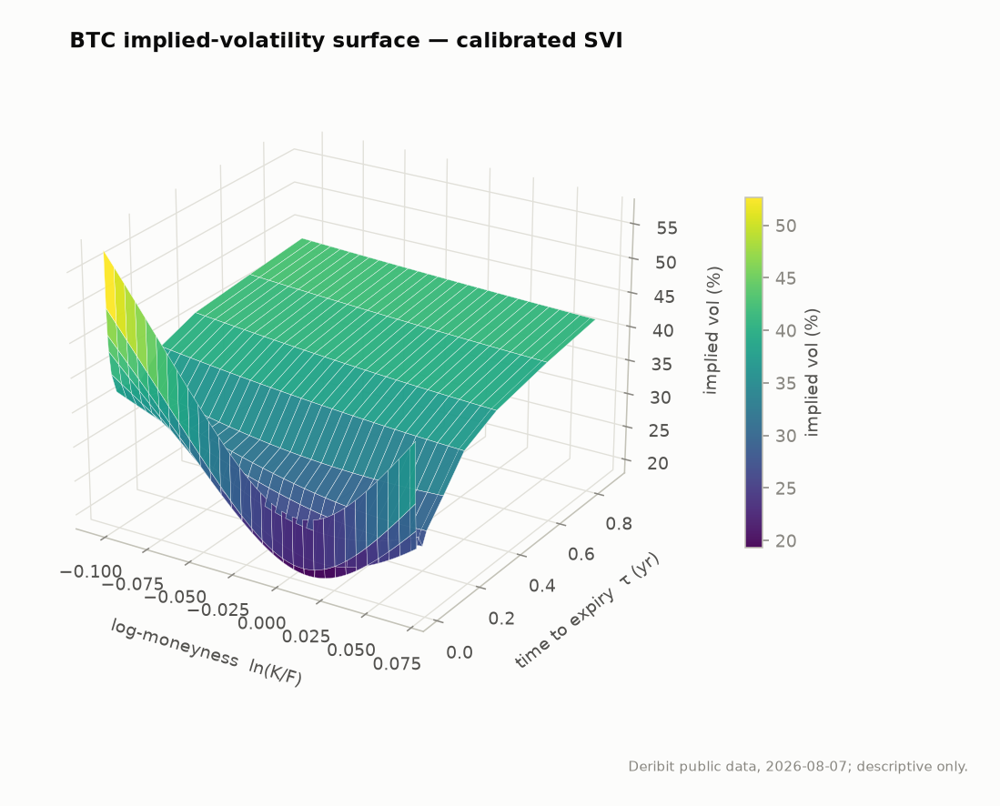
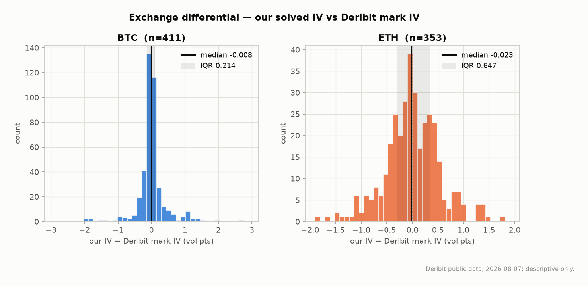
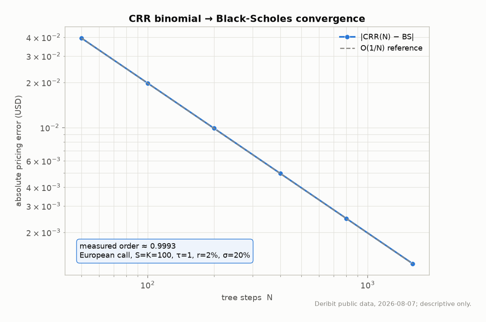
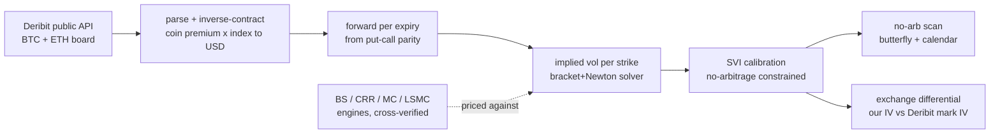

# vol-lab

[](https://github.com/billdmar/vol-lab/actions/workflows/ci.yml)
[](https://www.python.org/)
[](#headline-stats)
[](pyproject.toml)
[](LICENSE)

**An options pricing and implied-volatility surface engine on real Deribit crypto-options
data.** Four independent pricing engines — Black-Scholes, CRR binomial, Monte Carlo, and
Longstaff-Schwartz — cross-verified against each other, against theory, and against the
exchange's own published mark IV, with SVI surface calibration under no-arbitrage
constraints and a strictly descriptive BTC/ETH volatility research note.

> Pricing has *right answers*. This project is built to be **proven wrong** where it is:
> every engine is checked against the others, parity holds to machine precision, and our
> implied vols are held up against Deribit's published mark IV — differences reported, not
> tuned away. No trading claims, no forecasts.

## Headline stats

| Metric | Value |
|---|---|
| Market data | **1,540 live Deribit instruments** (BTC 830 + ETH 710), 12 expiries each |
| Pricing engines | 4 (Black-Scholes · CRR binomial · Monte Carlo · Longstaff-Schwartz) |
| Binomial → BS convergence order | **0.9993** (measured, first-order as theory predicts) |
| MC variance-reduction speedup | **8.5×** (control variate), 6.4× (combined), 1.3× (antithetic)¹ |
| Greeks 3-way reconciliation | closed-form vs FD `<1e-4`; vs MC pathwise/LR `<0.5%` |
| Put-call parity (model) | **~2e-14** (machine precision, gate 1e-10) |
| **Exchange differential** vs Deribit mark IV | median \|Δσ\| = **0.18 vol pts (BTC)** / 0.39 (ETH)² |
| No-arbitrage scan | 0 calendar violations; butterfly clean in the liquid region |
| Test coverage (engines) | **96%** (every module ≥ 91%), 201 tests, green CI |

*¹ Variance-reduction speedup is measured as the equal-precision path-count multiplier at
S=K=100, τ=0.75, r=3%, σ=65%, q=1%, 100k paths, seed 12345 (it is parameter-dependent;
`variance_reduction_report(...)`). Control-alone beats the combo here — reported honestly.*

*² The 0.18/0.39 exchange headline is the mean of the two snapshots' per-snapshot median
|Δσ| (BTC 0.11 & 0.25, ETH 0.32 & 0.45); `report_surface.py` prints the per-snapshot values.*

*Snapshot window: 2 intraday snapshots on 2026-08-07 (the resumable collector accumulates
more days over time). Reproduce every number: `python scripts/report_surface.py --all-snapshots`.*

## Showcase





## How it works



Snapshot → USD conversion → parity forward → IV solve → SVI surface → no-arb scan +
exchange differential. The four pricing engines are cross-verified against each other and
feed the IV solver; every stage's conventions and tolerances are in
[`docs/DESIGN.md`](docs/DESIGN.md) and [`config/tolerances.py`](config/tolerances.py).

## Verification (the point of the project)

1. **Cross-engine differential** — CRR European price converges to Black-Scholes with a
   *measured* order of 0.9993 (log-log Richardson fit, even-N to avoid the odd/even
   sawtooth); MC 95% confidence intervals cover the closed form across a strike/vol grid.
2. **Greeks three-way** — closed-form vs central finite differences (`<1e-4` rel) vs MC
   pathwise/likelihood-ratio estimators (`<0.5%` rel), each reported with its own stderr.
3. **Put-call parity** — machine precision (~2e-14) on model prices; bounded, reported
   residuals on market snapshots.
4. **No-arbitrage** — butterfly (Gatheral's Durrleman `g(k) ≥ 0`) + calendar monotonicity
   on every calibrated surface; violations quantified with location, never smoothed.
5. **Exchange differential** — our solver's implied vols vs Deribit's published mark IV;
   the full distribution is printed (median \|Δσ\| 0.18/0.39 vol pts), with outliers
   diagnosed — no "agreement" claimed without the distribution behind it.
6. **Property tests** (hypothesis) — price bounds, monotonicity in vol/spot/strike,
   American ≥ European, parity — as invariants over thousands of random inputs.
7. **Determinism** — everything seeded; `report_surface.py` regenerates byte-identically and
   every figure regenerates deterministically in content (a few are not bit-identical across
   runs due to minor matplotlib/Agg rasterization non-determinism). **Tolerance registry**
   (`config/tolerances.py`): every differential bound in one file with a written
   justification, never widened to force a pass.

## What the research note found (descriptive only)

Contango term structure for both coins (BTC 26→42%, ETH 34→56% ATM vol); BTC carries a
uniform downside skew that steepens to −4.6 vol pts by ~4.5 months; **ETH's skew flips** —
front-end upside (call) skew turning downside by ~11 Aug. Full study with confidence
intervals and honest window caveats: [`docs/RESEARCH_NOTE.md`](docs/RESEARCH_NOTE.md).

## Quickstart

```bash
python3.12 -m venv .venv && source .venv/bin/activate
pip install -e ".[dev]"                       # pinned runtime + dev tooling (see pyproject.toml)

make verify                                   # ruff + mypy + 201 tests + coverage gate + report + figures
# or run the pieces directly:
ruff check . && mypy && coverage run -m pytest && coverage report
python scripts/report_surface.py --all-snapshots   # reproduce every statistic
python scripts/make_figures.py                     # regenerate all figures
python scripts/collect_snapshot.py                 # collect a fresh snapshot (polite, public API)
```

## Design highlights

- **Inverse contracts handled explicitly** — Deribit premiums are quoted in coin; USD =
  coin × index, both retained and documented (`src/deribit`, `docs/DESIGN.md`).
- **Forwards inferred, not assumed** — from put-call parity (`C−P` vs `K` regression);
  the inferred forward matches Deribit's own to within ~0.7% (most under 0.3%; the sole
  outlier is one thin far-dated ETH line, 25Jun27 at +0.69%).
- **Robust IV solver** — bracket + Newton with a vega floor and a Brent fallback; returns
  `None` on sub-intrinsic / vega-collapse inputs rather than a plausible-but-wrong vol.
- **SVI under no-arbitrage** — raw-SVI with a positive-variance global-min constraint and
  the Lee wing-slope bound, deterministic multi-start calibration.
- **Polite data etiquette** — public endpoints only, descriptive User-Agent, ≥ 250ms
  spacing, all responses cached as committed fixtures; **CI never calls the live API**.

See [`docs/DESIGN.md`](docs/DESIGN.md) for every modeling choice's rationale.

## Documentation

| Doc | What it's for |
|---|---|
| [`docs/PROJECT_OVERVIEW.md`](docs/PROJECT_OVERVIEW.md) | Guided tour — architecture, repo map, design rationale, how to read/run |
| [`docs/DESIGN.md`](docs/DESIGN.md) | The *why* behind every modeling choice + the tolerance/gate map |
| [`docs/RESEARCH_NOTE.md`](docs/RESEARCH_NOTE.md) | Descriptive BTC/ETH vol study (smile, skew, term structure) with CIs |
| [`docs/ENV.md`](docs/ENV.md) | Machine + pinned toolchain |

## License
MIT — see [LICENSE](LICENSE).
