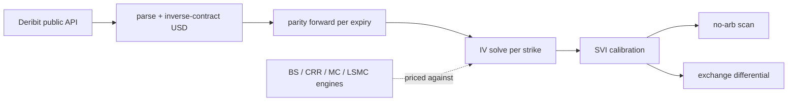

# vol-lab — Project Overview

A guided tour of what vol-lab is, why it's built the way it is, where every piece lives,
and how to run and verify it. This is the orientation layer: it **links out** to the
detailed docs rather than repeating them —

| Want… | Read |
|---|---|
| headline stats + figures + quickstart | [`README.md`](../README.md) |
| the *why* behind each modeling choice | [`DESIGN.md`](DESIGN.md) |
| the descriptive BTC/ETH market findings | [`RESEARCH_NOTE.md`](RESEARCH_NOTE.md) |
| 18 interview questions answered from the code | [`INTERVIEW_NOTES.md`](INTERVIEW_NOTES.md) |
| a one-page rapid-recall crib | [`CHEATSHEET.md`](CHEATSHEET.md) |
| resume bullets + talking points | [`RESUME_BULLETS.md`](RESUME_BULLETS.md) |
| machine / pinned toolchain | [`ENV.md`](ENV.md) |

---

## 1. What this is, and why it exists

vol-lab is an options-pricing and implied-volatility surface engine built on **real Deribit
crypto-options market data**. Four independent pricing engines — Black-Scholes, a CRR
binomial tree, Monte Carlo, and Longstaff-Schwartz — are cross-verified against each other,
against theory, and against the exchange's own published mark IV, with SVI smile calibration
under no-arbitrage constraints and a strictly descriptive BTC/ETH volatility research note.

It exists as the **derivatives / quant-research** entry in a portfolio, aimed at options
market-making desks (Akuna, CTC, Optiver, SIG, IMC) whose interview bar is exactly put-call
parity, Greeks intuition, implied vol, and the smile. The organizing principle is
*"pricing has right answers, so I built the project where I can be proven wrong."* Every
claim is a verified number or an honest **descriptive** statistic — **no trading strategy,
no PnL, no forecast** anywhere.

## 2. Why these design choices (the defensible ones)

The full rationale for each choice is in [`DESIGN.md`](DESIGN.md); the short "why" for the
ones that come up in interviews:

- **Why crypto / Deribit?** It is the only free, deep, *live* options market with public
  endpoints, and — critically — it publishes a per-instrument **mark IV**. That gives an
  *external* differential test (our solver vs the exchange's own number) that a textbook toy
  project can never have.
- **Why four engines, not one?** Pricing has ground truth, so redundancy is verification:
  the binomial tree must converge to Black-Scholes at a *measured* order, Monte Carlo's
  confidence intervals must cover the closed form, and Longstaff-Schwartz must match a fine
  lattice on American options. Agreement across independent algorithms is the proof.
- **Why descriptive-only?** A backtest with a PnL curve is unfalsifiable hindsight; a
  *correct price* is checkable. The research note reports smile shape, skew, and term
  structure with confidence intervals and defers anything it can't support (see §7).
- **Why infer forwards from parity?** The forward is *measured* from put-call parity on
  liquid strikes, not assumed from a rate curve — and it's cross-checked against Deribit's
  own forward (agreement within ~0.7%). Parity is used operationally, not just recited.
- **Why SVI, and why honest-unknown?** Raw SVI parameterizes total variance directly, so the
  no-arbitrage conditions (calendar monotonicity, Gatheral's butterfly `g(k)`) map to cheap
  checks. And the IV solver returns `None` — never a fabricated vol — when no arbitrage-free
  implied vol exists.

## 3. Architecture & repo tour

Data flows in one direction; each stage is a small, single-purpose module.



**Verified end-to-end call chain** (the real path through the code):
`store.load_snapshot` → `surface.build_surface` → `forwards.infer_forward` →
`smiles.build_smile` → `bs.BlackScholes.implied_vol` → `svi.calibrate_svi` →
`surface._rr_bf_25` → `noarb.scan_surface` → `exchdiff.run_exchange_differential`.

**Where to find each concept:**

| Concept | File · entry point |
|---|---|
| Data contracts (OptionQuote/Snapshot/SurfacePoint) | `src/schema.py` |
| Engine protocols (Pricer/GreeksEngine/IVSolver/Calibrator) | `src/interfaces.py` |
| Shared helpers (intrinsic, mean_stderr, DEFAULT_SEED) | `src/common.py` |
| Black-Scholes price / Greeks / IV solver | `src/bs/black_scholes.py` · `BlackScholes` (singleton `BS`) |
| CRR binomial + convergence harness | `src/lattice/crr.py` · `CRRBinomial`, `convergence_order` |
| Monte Carlo + variance-reduction report | `src/mc/engine.py` · `MonteCarloPricer`, `variance_reduction_report` |
| Longstaff-Schwartz American | `src/lsmc/lsmc.py` · `LSMCPricer` |
| Deribit parse / load / filter / group | `src/deribit/{parse,store,filters,group}.py` |
| Forwards from parity | `src/surface/forwards.py` · `infer_forward` |
| Smiles (market-IV inversion) | `src/surface/smiles.py` · `build_smile` |
| SVI calibration | `src/surface/svi.py` · `calibrate_svi`, `svi_iv` |
| Surface assembly + 25Δ RR/BF | `src/surface/surface.py` · `build_surface` |
| No-arbitrage scan (Durrleman g, calendar) | `src/noarb/scan.py` · `scan_surface`, `durrleman_g` |
| Exchange differential vs mark IV | `src/exchdiff/differential.py` · `run_exchange_differential` |
| Figure house style | `src/viz/style.py` |
| Tolerance registry (13 entries) | `config/tolerances.py` · `TOL` |
| Snapshot collector / report / figures | `scripts/{collect_snapshot,report_surface,make_figures}.py` |

## 4. The four pricing engines

Each implements the frozen protocols in `src/interfaces.py`, so the cross-engine gate treats
them uniformly. The interview Q&A for each is in [`INTERVIEW_NOTES.md`](INTERVIEW_NOTES.md).

- **Black-Scholes** (`src/bs/black_scholes.py`) — the reference. Forward-form BSM
  (`fwd = spot·e^{(r−q)τ}`, `df = e^{−rτ}`); the normal CDF uses `math.erfc` for tail accuracy
  where the deep-OTM IV solver needs it. Closed-form delta/gamma/vega/theta(per-year)/rho.
  The IV solver is a safeguarded Newton (bracket → Newton with a vega floor → bisection →
  Brent fallback) that converges price to ~1e-8 and returns `None` on sub-intrinsic /
  at-ceiling / vega-collapse inputs. *Defensible bit:* honest-unknown, never a fabricated vol.
- **CRR binomial** (`src/lattice/crr.py`) — `u = e^{σ√dt}`, `d = 1/u`,
  `p = (e^{(r−q)dt} − d)/(u − d)`; European + American (early exercise = `max(continuation,
  intrinsic)` at each node). *Defensible bit:* if `p ∉ [0,1]` the tree is arbitrageable and the
  code **raises** rather than clipping to a fake probability. `convergence_order()` fits
  `log|CRR−BS|` vs `log N` on an even-N ladder.
- **Monte Carlo** (`src/mc/engine.py`) — exact single-step terminal lognormal (no Euler bias);
  antithetic variates + a control variate (discounted terminal spot, whose mean
  `spot·e^{−qτ}` is analytic, so the estimator stays unbiased); pathwise + likelihood-ratio
  Greeks, each with its own stderr. *Defensible bit:* the antithetic stderr is computed on
  pair-means, not the correlated draws.
- **Longstaff-Schwartz** (`src/lsmc/lsmc.py`) — American via regression of *discounted
  realized future cashflow* on a scaled-spot polynomial basis, over **in-the-money paths
  only**. *Defensible bit:* no look-ahead bias — it regresses on realized cashflows, and
  t=0 is never an exercise date.

## 5. Verification architecture (the engineering-maturity story)

Verification is the point of the project, not an afterthought.

- **Tolerance registry** — `config/tolerances.py` holds **13** named tolerances, each a
  `Tol(value, kind, why)` with a written mathematical justification. The hard rule (stated in
  the module docstring): a tolerance is *never* widened to make a test pass — a failure is
  investigated and written up. The gate→tolerance map is in [`DESIGN.md`](DESIGN.md).
- **Property tests** (`tests/test_properties.py`, hypothesis) — price bounds, monotonicity in
  vol/spot/strike, parity as a property, American ≥ European, and a negative-rate regime;
  deterministic profile (`derandomize=True`).
- **G1 — engine cross-verification** (`tests/test_integration_g1.py`) — binomial→BS measured
  convergence order, MC 95% CI coverage, three-way Greeks reconciliation (closed form vs
  central finite differences vs MC), parity to machine precision.
- **G2 — surface verification** (`tests/test_integration_g2.py`) — the full pipeline on the
  committed fixtures, zero calendar-arbitrage violations, and the exchange differential.
- **Exchange differential** — the external ground truth: our independently-written IV solver
  vs Deribit's published mark IV, descriptive-only, with the full distribution always printed.
- **Determinism** — one seed (`DEFAULT_SEED = 12345`); SVI/no-arb are RNG-free; the surface
  report regenerates byte-identically and figures are content-deterministic; CI **never calls
  the live Deribit API** (runs only on committed fixtures).

## 6. How to read and run it

Suggested reading order: **README → this doc → DESIGN → RESEARCH_NOTE → INTERVIEW_NOTES**.

```bash
python3.12 -m venv .venv && source .venv/bin/activate
pip install -e ".[dev]"

make verify                                  # ruff + mypy + tests + coverage gate + report + figures
python scripts/report_surface.py --all-snapshots   # every surface/verification statistic
python scripts/make_figures.py                     # regenerate the 8 showcase figures
python scripts/collect_snapshot.py                 # collect a fresh polite snapshot (public API)
```

Everything the README and research note cite is reproducible from the committed fixtures by
`report_surface.py`; the figures are regenerated by `make_figures.py`.

## 7. Limitations & roadmap (the honest forward-look)

- **Data window.** The committed fixtures are **two intraday snapshots from a single UTC day
  (2026-08-07)**. Cross-sectional findings (smile shape, skew, term structure, exchange
  differential) are well-supported and stable across both snapshots; any **time-series**
  statement — notably **IV vs. subsequently realized volatility** — is *explicitly deferred*
  rather than fabricated. The collector is resumable and accumulates one distinct UTC day per
  calendar day toward the ≥5-day target; more days unlock the realized-vol comparison.
- **Scope.** Descriptive statistics only; no dynamic hedging simulation, no exotic payoffs.
- **Stretch (not built).** A pybind11 C++ Monte Carlo kernel with a measured speedup, or a
  CBOE delayed-quote equity-options extension proving the pipeline is asset-agnostic — both
  deliberately deferred so the numerics stay the focus.

## 8. Provenance

Public repo: <https://github.com/billdmar/vol-lab> · MIT · Python 3.12 · CI green.
Releases track the build: v1.0.0 (engines + surface + note), v1.1.0 (correctness/accuracy
hardening), v1.2.0 (source clarity + robustness), v1.3.0 (this documentation pack).
