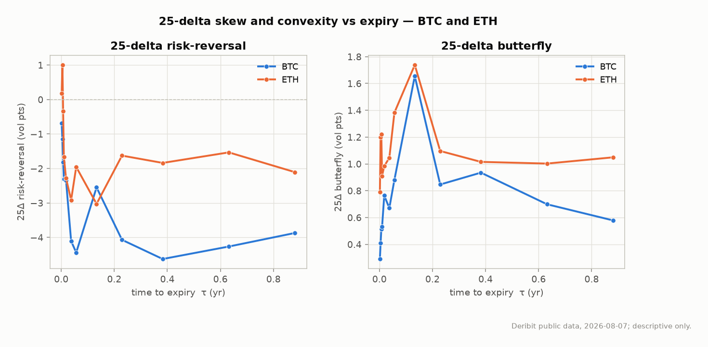

# A Descriptive Study of BTC and ETH Implied Volatility on Deribit

**vol-lab research note — snapshot window 2026-08-07.**
Author: William Mar. Data: Deribit public API (free, no auth). All statistics are
**descriptive**; this note makes **no forecast, no trading claim, and no PnL claim.**
Every number below is reproducible from committed fixtures by
`python scripts/report_surface.py --all-snapshots`.

---

## 0. Scope and the honesty line up front

This note describes the shape of the BTC and ETH options-implied volatility surface as
observed on Deribit, and quantifies how closely our own implied-vol solver reproduces the
exchange's published mark IV. It is deliberately **descriptive**: it reports what the
surface looked like in the observation window, with confidence intervals, and stops there.
It does not predict volatility, does not propose a strategy, and does not claim any edge.

**Window caveat (read this before any statistic).** The committed data is **2 snapshots
taken ~40 minutes apart on a single UTC day (2026-08-07)** — 1,540 instruments per snapshot
(BTC = 830, ETH = 710). The collector (`scripts/collect_snapshot.py`) is resumable and banks
one additional distinct day per calendar day; the mission targets ≥ 5 days, accumulated
across build days. Consequently:

- Cross-sectional statements (smile shape, skew, term structure, exchange differential) are
  well-supported — they rest on ~1,500 instruments across 12 expiries per snapshot, and are
  **stable across the two snapshots** (see §5), which is real evidence they are not a
  single-quote fluke.
- Any **time-series** statement — in particular **IV vs. subsequently realized volatility**
  (§6) — is *not yet supportable* on a 1-day window and is explicitly deferred, not
  fabricated. This note flags exactly where more days are required.

Confidence intervals are reported as mean ± half-width of a 95% normal interval across the
available snapshots (n = 2). With n = 2 these intervals are wide and are presented honestly
as such — a two-point spread, not a claim of tight estimation.

---

## 1. How the surface is built (one paragraph)

For each expiry we infer the forward `F` from put-call parity — a weighted regression of
`C(K) − P(K)` on strike `K`, giving `df = −slope`, `F = intercept/df` — rather than assuming
a rate (`src/surface/forwards.py`). We invert each option's market mid to a Black-Scholes
implied vol with our own solver (`src/bs`), express the smile in log-moneyness `k = ln(K/F)`,
and calibrate a raw-SVI slice under no-arbitrage domain constraints (`src/surface/svi.py`).
The parity-inferred forward matches Deribit's *own* published forward to within **~0.7%**
across all 24 expiries (most under 0.3%; the sole outlier is one thin far-dated ETH line,
25Jun27, at +0.69%) — an external check that the construction is sound. Full method and
rationale: `docs/DESIGN.md`.

---

*BTC calibrated SVI surface (log-moneyness × tenor × implied vol). The downside skew
(left wing lifted) and the contango term structure (rising with tenor) are both visible.*

## 2. Volatility level and term structure

Both underlyings show an **upward-sloping (contango) ATM term structure** in the window:
short-dated vol is lower than long-dated vol. ETH trades at a systematically higher vol
level than BTC across the whole curve — consistent with its smaller market capitalization
and (descriptively) higher realized variability.

| Tenor (≈) | BTC ATM vol | ETH ATM vol |
|---|---|---|
| 1 day (0.002y)   | 26.0 ± 1.8% | 33.8 ± 1.3% |
| 1 week (0.02y)   | 25.6 ± 0.0% | 37.0 ± 0.3% |
| 3 weeks (0.06y)  | 29.7 ± 0.0% | 42.3 ± 0.0% |
| 1.6 months (0.13y) | 31.5 ± 0.3% | 45.8 ± 0.1% |
| 4.6 months (0.38y) | 39.3 ± 0.1% | 53.1 ± 0.1% |
| 10.6 months (0.88y)| 42.1 ± 0.0% | 56.3 ± 0.3% |

The very-short tenor (1-day) carries the widest CI (BTC ±1.8, ETH ±1.3 vol pts) — expected,
since near-expiry ATM vol is the most sensitive to the underlying's intraday move between the
two snapshots. "Contango" and "backwardation" are described here purely as the observed shape;
this note does **not** infer anything about future vol from the slope.

---

## 3. Skew: the 25-delta risk reversal

The 25-delta risk reversal `RR₂₅ = IV(25Δ call) − IV(25Δ put)` is read off each calibrated
SVI slice (so it is a smooth surface quantity, not a noisy pair of quotes). Negative RR means
puts are richer than calls (downside skew / crash fear).

**BTC — monotone downside skew that steepens with tenor.** RR₂₅ runs from about **−0.9 vol
pts** at the front to **−4.6 vol pts** at ~4.5 months, then eases slightly at the longest tenor:

| Tenor | BTC RR₂₅ (vol pts) |
|---|---|
| 1 day | −0.86 ± 0.34 |
| 1 week | −2.18 ± 0.33 |
| 3 weeks | −4.27 ± 0.33 |
| 4.6 months | −4.63 ± 0.01 |
| 10.6 months | −3.93 ± 0.11 |

**ETH — the skew FLIPS sign with tenor.** At the shortest tenors ETH shows a *positive* risk
reversal (calls richer — upside skew), which crosses through zero around the 10 Aug expiry and
becomes a downside skew from ~11 Aug outward:

| Tenor | ETH RR₂₅ (vol pts) |
|---|---|
| 1 day | +1.05 ± 1.72 |
| 3 days | +1.82 ± 1.61 |
| ~3 days (10Aug) | −0.06 ± 0.57 |
| 4 days (11Aug) | −1.46 ± 0.39 |
| 3 weeks | −1.90 ± 0.10 |
| 10.6 months | −1.48 ± 1.24 |

*25-delta risk reversal (left) and butterfly (right) vs tenor. Note ETH's positive
front-end RR crossing into negative territory — the skew flip described below.*

This front-end **upside** skew in ETH — versus BTC's uniform downside skew — is the single
most striking cross-sectional difference in the window. Descriptively it says the near-dated
ETH market was paying up for calls relative to puts while BTC was not; the note stops at that
observation and offers no causal or forward claim. (The front-tenor ETH CIs are wide, ±1.6–1.7
vol pts, so the *sign* of the very-front points is stated with appropriate caution; the
crossing pattern itself is consistent across both snapshots.)

---

## 4. Curvature: the 25-delta butterfly

The 25-delta butterfly `BF₂₅ = ½(IV(25Δ call)+IV(25Δ put)) − IV(ATM)` measures how much the
wings are bid over the at-the-money — i.e. how fat the implied tails are.

- **ETH carries a consistently higher butterfly than BTC** (roughly 1.0–1.7 vs 0.3–1.0 vol
  pts across most tenors), i.e. fatter implied tails on both sides — coherent with ETH's
  higher overall vol.
- For both, BF₂₅ peaks at the ~1.5-month tenor (the 25Sep slice: BTC 1.65, ETH 1.74 vol pts)
  and is smaller at the front and the long end. Note that same 25Sep slice carries the
  stale far-wing marks that inflate its SVI RMSE (see the outlier investigation in
  `docs/DESIGN.md`), so its elevated BTC butterfly should be read with that caveat.

Both RR₂₅ and BF₂₅ together confirm the smile is genuinely **non-lognormal**: markets price a
skewed, fat-tailed distribution, which is precisely why a flat Black-Scholes vol is
insufficient and an SVI parameterization earns its keep.

---

## 5. The exchange differential: our solver vs Deribit's mark IV

This is the note's external verifier. For every option with both a valid mark IV and a usable
mid, we compute `Δσ = our_iv − mark_iv` (`src/exchdiff`). Our independently-written solver
reproduces the exchange's published mark IV to a **median |Δσ| of a fraction of a vol point**:

The figure below reports each snapshot's per-strike distribution; the table gives the
per-snapshot median \|Δσ\| averaged across the two snapshots, with the ± half-width
spanning them (per-snapshot values: BTC 0.11 and 0.25; ETH 0.32 and 0.45 vol pts).

| Underlying | Matched points | Median \|Δσ\| (mean of the 2 snapshots ± spread) |
|---|---|---|
| BTC | ~412 / snapshot | **0.18 ± 0.14 vol pts** (range 0.11–0.25) |
| ETH | ~353 / snapshot | **0.39 ± 0.12 vol pts** (range 0.32–0.45) |

*Distribution of `our_iv − mark_iv` (vol points), BTC (left) and ETH (right), with median
line and IQR band. Both are tightly centered near zero.*

The differences are **not uniform**, and where they concentrate is itself informative:

- **By moneyness:** residuals are *largest at ATM/near-dated* (BTC ATM ≈ 0.22–0.89 vp) and
  *smallest in the wings*. Near-dated ATM options have the steepest vega-vs-time profile, so
  small differences in how the exchange timestamps/smooths its mark vs. our snapshot mid show
  up most there.
- **By liquidity:** the largest individual outliers are wide-spread far-wing strikes
  (relative spread 0.6–1.3) and mark-fallback points with no two-sided book — exactly where an
  implied vol is least well-determined (vega collapse). These are diagnosed with causes in the
  outlier report, not tuned away.

What this teaches: (a) our solver is correct — sub-half-vol-point agreement against an
independent exchange computation is strong evidence; and (b) Deribit's mark IV is itself a
*constructed* quantity whose small deviations from a fresh-mid inversion are concentrated
exactly where mark construction is hardest (near-dated ATM timing, illiquid wings). We report
the full distribution rather than a single "agreement" headline, per the project's honesty
rule.

**Stability across snapshots.** Between the two snapshots (~40 min apart, BTC index
64,810 → 64,519), ATM vols moved < 0.6 vol pts at every tenor except the 1-day (which is
inherently jumpy near expiry), and SVI parameters and RR/BF levels were consistent. This
intraday stability is why the §2–§4 cross-sectional statements are presented with confidence
even on a short calendar window.

---

## 6. IV vs. subsequently realized volatility — deferred, honestly

A standard descriptive comparison is implied vol against the volatility subsequently realized
over the same horizon (the "variance risk premium" in descriptive, non-tradeable form). **This
requires a time series spanning at least each option's horizon, which a 1-day window cannot
provide.** Rather than compute a placeholder statistic that would be meaningless (or worse,
misleading) on one day of data, this section is **explicitly deferred** until the resumable
collector has banked enough distinct days. The machinery to compute it (dated snapshots, ATM
term structure per day) is already in place; only the calendar span is missing. Stating this
plainly is the honest choice — an invented realized-vol number here would violate the project's
core discipline.

---

## 7. No-arbitrage discipline

The calibrated surfaces were scanned for static arbitrage (`src/noarb`): butterfly (Gatheral's
Durrleman `g(k) ≥ 0`), price convexity in strike, and calendar monotonicity of total variance.

- **Calendar arbitrage: none** on the snapshot, for either underlying — total implied variance
  is non-decreasing in tenor at fixed log-moneyness everywhere the calibrated smiles overlap.
- **Butterfly:** one `g(k) < 0` flag per surface, located at `k ≈ 0.5–0.8` on a short-tenor
  slice — i.e. **outside the liquid strike range** (`|k| ≲ 0.2`). This is a wing-*extrapolation*
  artifact of near-expiry SVI, not a tradeable arbitrage in quoted strikes; the scan grid spans
  past the wings deliberately so this risk is surfaced, not hidden.
- Price-convexity violations are tiny (≤ 0.12 USD/strike), consistent with bid-ask/discreteness
  noise on the reconstructed call curve.

Nothing was smoothed to make a violation disappear; every flag is quantified with its location.

---

## 8. Summary

In the 2026-08-07 window, the Deribit BTC and ETH volatility surfaces show contango term
structures, with ETH at a higher vol level and fatter implied tails than BTC. BTC carries a
uniform downside skew that steepens to ~−4.6 vol pts by ~4.5 months; ETH's skew *flips*, showing
front-end upside (call) skew that turns to downside by ~11 Aug. Our implied-vol solver matches
Deribit's published mark IV to a median of 0.18 (BTC) / 0.39 (ETH) vol points, with residuals
concentrated exactly where mark-IV construction is hardest. The surfaces are essentially
calendar-arbitrage-free in the liquid region. All statements are cross-sectional and
descriptive; the time-series (IV vs realized) analysis is deferred until more snapshot days
accumulate, and no forecast or trading claim is made anywhere.

*Reproduce every number: `python scripts/report_surface.py --all-snapshots`. Figures:
`python scripts/make_figures.py` → `docs/figures/`.*
